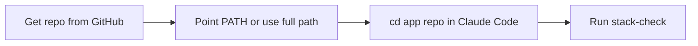

# Using dev-checklist with Claude Code (install from GitHub)

Run **`stack-check`** from your **application repository** (the project you are building), not only from a checkout of this template. In Claude Code, use the **integrated terminal** the same way you would in a local shell.

## Prerequisites

- **Git** and **bash** (macOS and Linux are supported).
- A terminal, including the one inside **Claude Code**.

## Get this repo from GitHub

Replace `<OWNER>` and `<REPO>` with the real GitHub path after you have published the repository (for example: `octocat/dev-checklist`).

### Option A: Clone (recommended)

You get the full `stack-check` script plus [readiness-checklist.md](../readiness-checklist.md) beside it (the script points to that file for the “missing link” and manual layer notes).

```bash
git clone https://github.com/<OWNER>/<REPO>.git
cd <REPO>
chmod +x stack-check
./stack-check
```

To run checks against **another** project, stay in the app repo and call the script by path:

```bash
cd /path/to/your/app
/path/where/you/cloned/<REPO>/stack-check
```

### Option B: Download only the script (raw)

For a **single file** from the `main` branch:

```text
https://raw.githubusercontent.com/<OWNER>/<REPO>/main/stack-check
```

Save it, then:

```bash
chmod +x stack-check
./stack-check
```

**Note:** Remediation output and the manual checklist are best when the full repo (or at least `readiness-checklist.md` in the same directory as `stack-check`) is present. The script resolves `readiness-checklist.md` from its own directory. If you only download the raw script, copy `readiness-checklist.md` next to it or use a full clone.

## Use inside Claude Code

1. Open **Claude Code** for your app.
2. Open the **Terminal** in Claude Code.
3. `cd` to your **app repo root** (the project whose stack you are verifying).
4. Run `stack-check` (full path to your clone) or add it to your `PATH` once (see below).

This answers: “Is the agentic stack in place for **this** repo or phase?” — not the dev-checklist template itself.

## Optional: RTK (token optimization, Layer 4)

For compressed shell output in agent sessions, the stack article recommends [RTK](https://github.com/rtk-ai/rtk). For Claude Code specifically:

```bash
# after installing rtk (see rtk README: brew, curl install script, etc.)
rtk init -g
```

Then restart Claude Code. This is **optional**; `stack-check` will **WARN** if `rtk` is not on `PATH` unless you [require it](../.stack-check.yaml.example) for a stricter phase.

## Optional: put `stack-check` on your PATH

```bash
# zsh
echo 'export PATH="/path/to/cloned/<REPO>:$PATH"' >> ~/.zshrc
# or a dedicated bin directory and symlink
ln -s /path/to/cloned/<REPO>/stack-check ~/.local/bin/stack-check
```

Use the real path to your clone instead of `/path/to/cloned/<REPO>`.

## Phase-specific requirements

Copy [`.stack-check.yaml.example`](../.stack-check.yaml.example) to **your app repo** as `.stack-check.yaml` and toggle `require_layer4_rtk`, `require_layer5_gsd`, etc., when a milestone demands those layers.

## More documentation

- [README.md](../README.md) — quick start, environment variables, exit codes, troubleshooting.
- [readiness-checklist.md](../readiness-checklist.md) — full five layers and spec-to-code traceability (manual).
- [session-start.md](../session-start.md) — short daily session boot; optional `stack-check` when you need stack confidence.

## Flow


